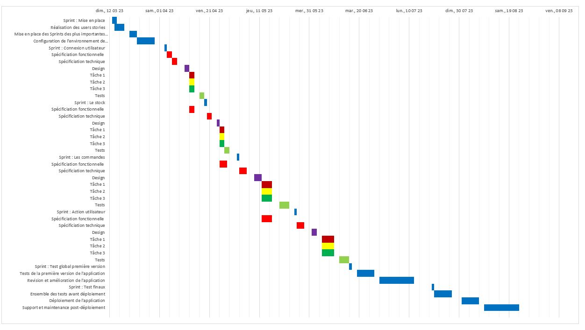

# **Projet N°8 : "OC_Pizza solution technique d'un système de gestion de pizzerias" OPENCLASSROOMS**
_________________________________________________________________________________________________________________

Ce dépot contient une mini-application pour le Projet 8 du parcours Grande École du Numérique pour le cursus Développeur d'Application Android

## Introduction

Concevez la solution technique d’un système de gestion de pizzerias.

*La demande :*

Le client a besoin d’un système informatique déployé dans toutes ses pizzerias, lui permettant d’être plus efficace dans la gestion des commandes, de leur réception à leur livraison, en passant par leur préparation, via les fonctionnalités suivantes :


Pour les employés :
 
- le suivi en temps réel des commandes passées et en préparation ;
- le suivi en temps réel du stock d’ingrédients restants, pour savoir quelles pizzas sont encore réalisables ;
- un aide-mémoire pour les pizzaiolos, indiquant la recette de chaque pizza.

Pour les clients, une application android qui leur permettra : 

- de passer leur commande – en plus de la prise de commande par téléphone ou sur place,
- de payer en ligne leur commande s’ils le souhaitent – sinon, ils paieront directement à la livraison,
- de modifier ou d’annuler leur commande, tant que celle-ci n’a pas été préparée ;
- de recevoir les notifications quand la commande est prête à être livrée ou réceptionnée.

On ne développera pas ici une application mais tout le process nécessaire au bon développement d'une application ou d'un logiciel.
_________________________________________________________________________________________________________________

## Diagramme de classe



_________________________________________________________________________________________________________________

## Modèle relationnel de la base de données



_________________________________________________________________________________________________________________

## Scripts SQL et jeu de données



_________________________________________________________________________________________________________________

## Choix de la méthodologie de projet choisi

Pour le développement de cette application Android, il est recommandé d'utiliser une méthodologie
agile, telle que Scrum (mêlée). En plus d’avoir une plus grande flexibilité, elle permet de répondre
rapidement aux exigences changeantes du client.
Dans un projet Scrum, le travail est découpé en sprints (cycles) de deux à quatre semaines, au cours
desquelles les membres de l'équipe travaillent sur les éléments prioritaires du backlog (un grand
tableau).

Un sprint est découpé en story :

- Manuel utilisateur (spécifications fonctionnelles),
- Documentation technique (spécifications techniques),
- Code,
- Tests.

À la fin de chaque sprint, l'équipe présente une version fonctionnelle de l'application qui peut être
testée par les utilisateurs et les parties prenantes.
Cette approche offre plusieurs avantages pour un projet de développement d'application Android :

• Elle permet de livrer rapidement des fonctionnalités, ce qui peut aider à obtenir des retours
rapides sur le produit tel que le déploiement des fonctionnalités liés au contrôle du stock.

• Elle permet une collaboration étroite avec le client ou les parties prenantes, pour garantir que
le développement de l'application répond à leurs besoins.

• Elle offre une flexibilité pour faire des ajustements au produit en cours de route, en fonction des
retours d'expérience et des besoins évolutifs.

• Elle favorise la communication au sein de l'équipe de développement, ce qui peut améliorer la
qualité du produit final.

La contrainte de temps (dans notre cas un délai de 6 mois) :
La méthode Scrum peut être adaptée en fonction des besoins du projet pour s'assurer que les objectifs
sont atteints dans les délais impartis. Elle nécessite une bonne planification et une forte collaboration
entre les membres de l'équipe pour la réussite du projet.

_________________________________________________________________________________________________________________

## Macroplanning



_________________________________________________________________________________________________________________

## Diagramme de Gantt



_________________________________________________________________________________________________________________

## Matrice RACI



_________________________________________________________________________________________________________________

## Présentation format pdf :

- 

## Présentation global du projet format powerpoint :

- 











